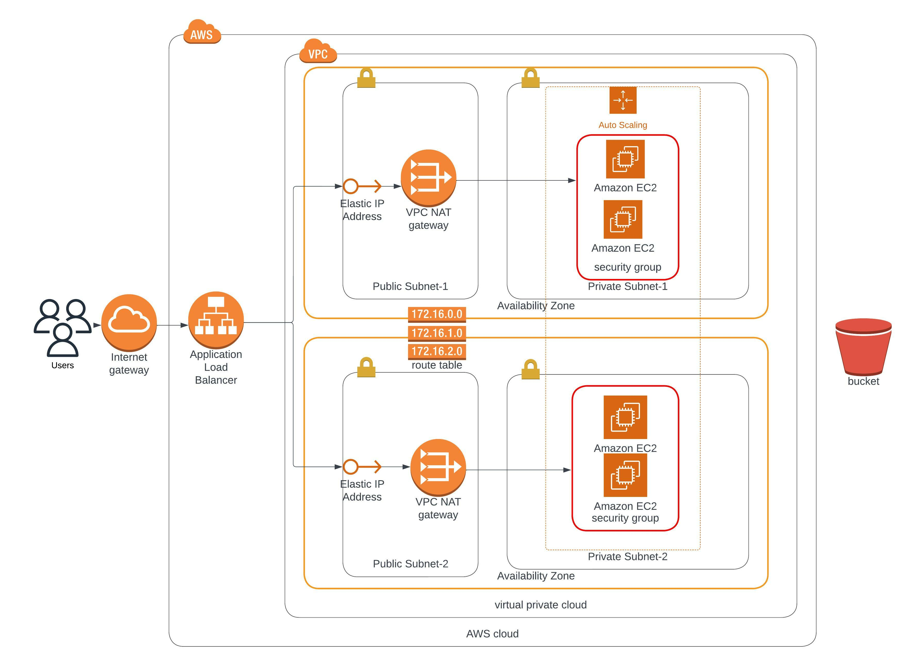

## Deploy a high-availability web app using CloudFormation - Udacity Project
This repo is the implementation of Advanced Cloud DevOps Udacity course project 2 
  
### Dependencies
##### 1. AWS account
You would require to have an AWS account to be able to build cloud infrastructure.

##### 2. VS code editor
An editor would be helpful to visualize the image as well as code. Download the VS Code editor [here](https://code.visualstudio.com/download).

##### 3. An account on www.lucidchart.com
A free user-account on [www.lucidchart.com](www.lucidchart.com) is required to be able to draw the web app architecture diagrams for AWS.

### Cloudformation diagram


### Description
This is and implementation of the Cloudformation diagram specified in the the previous section diagram.
The implementation is devided into two parts: 
    * The network side which can be found in network.yml and the parameters of the network is in network_params.json
    * The server side which can be found in server.yml and the parameters of the server is in server_params.json

### Test Url
The url for testing the loadbalancer: http://proje-webap-x4axy20obqu8-652384301.us-east-1.elb.amazonaws.com/
### How to run the supporting material?
You can run the supporting material in easy steps:
```bash
# Ensure that the AWS CLI is configured before runniing the command below
# Create the network infrastructure
# Check the region in the create_stack.sh file

# Create network stack
./create_stack.sh project2-network-stack network.yml network_params.json
# Create server stack
./create_stack.sh project2-server-stack server.yml server_params.json
# Update network stack
./update_stack.sh project2-network-stack network.yml network_params.json
# Update server stack
./update_stack.sh project2-server-stack server.yml server_params.json
# Delete network stack
./del_stack.sh project2-network-stack
# Delete server stack
./del_stack.sh project2-server-stack
```
